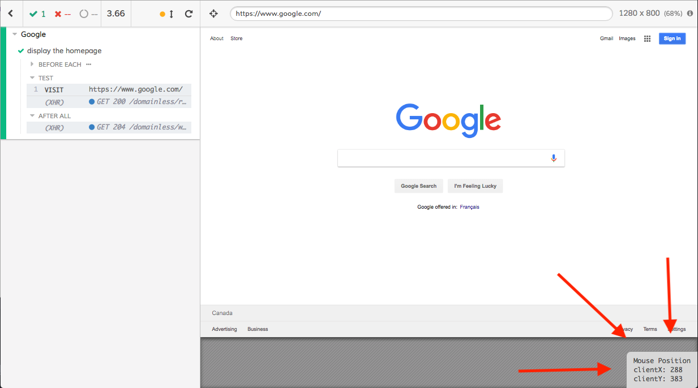

# Cypress Mouse Plugin

Plugin for displaying mouse position within Cypress' iframe where your app is tested.



## Installation

```
npm i -D cypress-mouse-position
```

In `cypress/plugins/index.js` add:

```javascript
const initCypressMousePositionPlugin = require('cypress-mouse-position/plugin');

module.exports = (on, config) => {
  # ...
  initCypressMousePositionPlugin(on);
  # ...
}
```

In `cypress/support/index.js` add:

```javascript
import 'cypress-mouse-position/commands';
```
